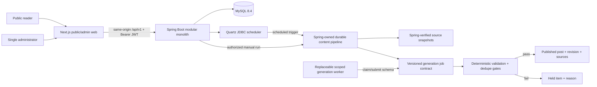

# PRD and Architecture Plan: Automated Content Blog

## Status and Sources of Truth

- Status: RALPLAN deliberate consensus approved; CR-001 approved by subsequent native Architect and Critic reviews on 2026-06-28.
- Requirements source: `.omx/specs/deep-interview-automated-content-blog.md`.
- Fixed stack requested by user: Spring Boot backend, React frontend, MySQL database, JWT authentication, explicit CORS support.
- Product invariants come from `.omx/specs/deep-interview-automated-content-blog.md:25-29`, `:31-68`, `:70-82`, and the twelve acceptance criteria under `## Testable Acceptance Criteria` at `:96-107`.
- This is greenfield; planned source paths below do not exist yet.

## Outcome

Deliver a public, SEO-friendly multi-topic blog with one authenticated administrator. Development/AI and configured news sources are researched through Codex-backed automation, validated, deduplicated, published automatically, and remain manually editable with complete revision/audit history. Scheduled and manual runs use one durable, idempotent pipeline.

## Requirements Summary

### Must deliver

- Public post feed/detail, categories, tags, archive, search, related content, RSS, sitemap, metadata, responsive UI.
- One administrator with login, dashboard, post/taxonomy/automation-topic/source/schedule management, run history, held-item review, and revision restore.
- Daily scheduling plus manual execution through the same orchestration service.
- Automatic publishing only after source accessibility, corroboration, and duplicate gates pass.
- JWT access authentication and rotated refresh sessions; exact-origin CORS policy and tests.
- MySQL-backed durable data, Flyway migrations, auditability, and observable job execution.
- Codex-backed research/generation without granting Codex direct database or publish authority.

### Explicit V1 non-goals

- Public accounts, multiple authors, comments/likes, newsletter/push, monetization, social auto-sharing.
- Microservices, Elasticsearch/OpenSearch, Kafka, Kubernetes, custom CMS framework, or custom authentication filters.

## RALPLAN-DR Summary

### Principles

1. Spring Boot owns business rules, persistence, publication state, and authorization.
2. Codex may propose content; deterministic application gates alone decide publication.
3. Security uses framework-supported JWT/CORS primitives and least privilege, never bespoke bearer filters.
4. Every scheduled/manual run is durable, idempotent, observable, and recoverable.
5. Choose the smallest architecture that preserves public SEO and administrator usability.

### Top Decision Drivers

1. Safe unattended publishing with traceable sources and reversible edits.
2. Public-blog SEO plus a productive React administration experience.
3. Maintainable greenfield delivery with strong auth, migrations, and realistic integration tests.

### Viable Options

#### Option A — Next.js React frontend + Spring modular monolith + isolated provider-neutral worker (chosen)

- Pros: first-class metadata/OG/sitemap and server rendering; Spring remains the single domain API; Codex permissions are isolated behind a job contract; clean path from personal local automation to hosted worker.
- Cons: JVM and Node runtimes; cache invalidation and server-to-server auth must be designed; worker lifecycle adds operations.

#### Option B — React Router framework mode + Spring modular monolith + isolated provider-neutral worker

- Pros: standards-oriented React stack, SSR/prerender supported, less Next-specific behavior.
- Cons: more manual metadata/sitemap/cache composition; smaller operational convention set for a content-heavy public site.

#### Option C — Vite SPA + Spring modular monolith + Codex App project automation only

- Pros: least runtime complexity and fastest initial scaffolding.
- Cons: weaker initial HTML/SEO, Codex App automation requires the machine and app to remain running, and UI-triggered runs cannot be treated as a reliable production scheduler.

### Selection rationale

Option A best satisfies the public-blog SEO and admin UX requirements while keeping domain authority in Spring. Option C remains a valid local-only MVP fallback, but it cannot honestly satisfy the durable automation and SEO objectives. Option B is sound but saves little complexity relative to Next while requiring more custom content-site plumbing.

## Selected Technology Baseline

Versions are current planning baselines as of 2026-06-28; scaffolding must pin the latest compatible patch and retain lockfiles/BOM ownership.

| Area | Selection | Planning rule |
| --- | --- | --- |
| JVM | Java 25 LTS | Fall back to Java 21 LTS only for a documented infrastructure incompatibility. |
| Backend | Spring Boot 4.1.x, Gradle Kotlin DSL | Use Boot dependency management; do not override Spring Security/Hibernate versions casually. |
| API | Spring MVC, Bean Validation, RFC 9457 Problem Details | Version under `/api/v1`; OpenAPI contract generated and diffed. |
| Persistence | Spring Data JPA, MySQL 8.4 LTS | Package-by-feature; explicit indexes; transactional state transitions. |
| Migrations | Flyway core + `flyway-mysql` | Flyway is the only schema authority; Hibernate `ddl-auto=validate`. |
| Security | Spring Security 7.1 line managed by Boot, OAuth2 Resource Server/Jose, Nimbus encoder/decoder | No custom `OncePerRequestFilter` for bearer JWT. |
| Frontend | Next.js App Router, React 19.2.x, TypeScript, Node 24 LTS, pnpm | Public pages use server rendering/revalidation; domain logic stays in Spring. |
| UI/data | Tailwind CSS, accessible source-owned component primitives, TanStack Query, React Hook Form, Zod | Keep dependencies bounded; use Client Components only where interactive. |
| Scheduling | Spring Quartz with JDBC JobStore | Required because schedules are edited in admin UI and must survive restarts. |
| Collection | Spring `RestClient`, ROME RSS/Atom, jsoup HTML extraction/sanitization, Resilience4j | Apply timeouts, rate limits, retry/backoff, circuit breaking, robots/terms rules. |
| Generation integration | Versioned worker/job contract; Codex SDK provider preferred after compatibility spike; optional Codex App project automation adapter | The provider returns schema-validated drafts and can never publish directly. |
| Observability | Actuator, Micrometer, Prometheus-format metrics, structured JSON logs, correlation IDs | Admin UI reads safe run diagnostics; sensitive values never enter logs. |
| Backend tests | JUnit 5, Spring Boot Test, MockMvc, Testcontainers MySQL, WireMock | MySQL and Flyway are exercised in integration tests. |
| Frontend tests | Vitest, Testing Library, MSW, Playwright, axe checks | Cover public SSR metadata and administrator flows. |

## External Evidence Applied

- Spring Boot current project/system requirements: https://spring.io/projects/spring-boot/ and https://docs.spring.io/spring-boot/system-requirements.html
- Spring Security JWT Resource Server and Nimbus support: https://docs.spring.io/spring-security/reference/servlet/oauth2-resource-server/jwt.html
- Spring Security CORS must be processed before security: https://docs.spring.io/spring-security/reference/servlet/integrations/cors.html
- Spring Boot Flyway initialization and Testcontainers: https://docs.spring.io/spring-boot/how-to/data-initialization.html and https://docs.spring.io/spring-boot/reference/testing/testcontainers.html
- React recommends a framework for new production apps and has deprecated Create React App: https://react.dev/learn/creating-a-react-app and https://react.dev/blog/2025/02/14/sunsetting-create-react-app
- Next App Router/metadata: https://nextjs.org/docs/app and https://nextjs.org/docs/app/getting-started/metadata-and-og-images
- MySQL 8.4 LTS release model: https://dev.mysql.com/doc/refman/8.4/en/mysql-releases.html
- Codex App automations require the local machine, Codex app, and project to remain available; therefore they are an optional orchestration surface, not the durable application scheduler: current Codex manual, Automations section.
- Codex SDK is the documented programmatic server-side integration surface: current Codex manual, Codex SDK section.
- Canonical project instruction filename is `AGENTS.md`, not `AGENT.md`: current Codex manual, Custom instructions with AGENTS.md section.

## Target Repository Shape

```text
/
  AGENTS.md
  README.md
  compose.yaml
  package.json
  pnpm-workspace.yaml
  pnpm-lock.yaml
  .env.example
  docs/
    architecture.md
    security.md
    automation.md
    runbook.md
  backend/
    build.gradle.kts
    settings.gradle.kts
    src/main/java/.../auth|post|taxonomy|source|automation|audit|analytics|shared/
    src/main/resources/application.yml
    src/main/resources/db/migration/mysql/
    src/test/java/...
  frontend/
    app/(public)/...
    app/admin/...
    src/features/...
    src/lib/api/...
    package.json
  generation-worker/
    src/worker.ts
    src/job-contract.ts
    src/prompts/...
    package.json
  contracts/
    openapi.yaml
    automation-job.schema.json
  e2e/
    playwright.config.ts
    tests/...
```

## Architecture and Boundaries



### Domain modules

- `auth`: admin credential bootstrap, password hashing, login, access JWT issuance, refresh rotation/revocation, logout.
- `post`: post aggregate, content state machine, revision snapshots, source citations, publication/revert.
- `taxonomy`: categories and tags.
- `source`: source registry, trust rules, fetch metadata, ETag/Last-Modified, policy flags.
- `automation`: schedules, runs, steps, jobs, idempotency keys, retry policy, manual/scheduled entry point.
- `audit`: immutable actor/action/target metadata and security events.
- `analytics`: privacy-minimal aggregate view counters.

### Core state models

- Post: `DRAFT`, `HELD`, `PUBLISHED`, `ARCHIVED`, `DELETED` (soft-delete with audit retention).
- Automation run: `QUEUED`, `RUNNING`, `SUCCEEDED`, `PARTIAL`, `FAILED`, `CANCELLED`.
- Codex job: `PENDING`, `CLAIMED`, `COMPLETED`, `REJECTED`, `EXPIRED`.
- Source assessment: accessible, corroborated, duplicate score, content fingerprint, policy result, reasons.

### Canonical production request topology

- Browser traffic uses one public origin. A reverse proxy sends page requests to Next and `/api/v1/**` requests to Spring; the browser never needs a production cross-site API URL.
- The browser sends access JWTs only to same-origin `/api/v1/**`. The refresh cookie is host-only, `Secure`, `HttpOnly`, `SameSite=Strict`, and `Path=/api/v1/auth` in the canonical production topology.
- Next server rendering calls public Spring read endpoints only. It receives no administrator or worker credential.
- CORS remains explicit and enabled for exact development/staging origins. Production configuration rejects non-canonical origins; wildcard origins are forbidden.

## Security Design

### JWT and session lifecycle

1. Admin login uses `AuthenticationManager` and a strong adaptive password hash managed by Spring Security.
2. Spring issues a 5–15 minute asymmetric access JWT with `iss`, `aud`, `sub`, `jti`, `iat`, `nbf`, `exp`, and `ROLE_ADMIN`.
3. Access JWT remains in frontend memory and is sent as `Authorization: Bearer`.
4. A high-entropy opaque refresh token is delivered only as the host-only cookie defined above; only its hash, family ID, predecessor/successor IDs, expiry, and revocation metadata are stored.
5. Refresh rotation is a database compare-and-swap transaction. Exactly one concurrent request consumes a token and creates its successor; any later reuse deterministically revokes the token family and requires a fresh login. Frontend same-tab single-flight is an optimization, not the correctness mechanism.
6. Spring Security validates bearer tokens through `oauth2ResourceServer().jwt()` and a configured `JwtDecoder`; no custom bearer filter.
7. Signing keys and bootstrap admin secrets are external configuration. Key rotation supports an active and previous verification key.

### CORS and browser protections

- Define one `CorsConfigurationSource`; enable `http.cors()` so preflight is processed before authentication.
- Permit only configured frontend origins, required methods, and headers; never use wildcard origins with credentials.
- Production routes web and API behind one reverse-proxy origin where possible, while retaining explicit CORS for local/staged origins.
- Refresh/logout endpoints validate exact `Origin` plus a double-submit CSRF token: a readable same-origin CSRF cookie is bound to the refresh family and must match the `X-CSRF-Token` header. Unsafe admin operations require the access JWT.
- Apply secure headers, request/body limits, rate limits for login/refresh/manual-run endpoints, and generic auth errors.

### Codex least-privilege boundary

- A generation worker receives only Spring-owned source snapshot IDs, sanitized excerpts, topic settings, job ID, and output schema—never DB credentials, admin JWTs, signing keys, or direct publish permissions.
- Worker authenticates with a separate scoped service credential that can only claim/submit automation jobs.
- Spring is the evidence authority: it fetches and hashes allowed sources before generation, verifies accessibility again before publication when the snapshot exceeds the freshness window, validates every returned citation against a stored snapshot, and owns the final state transition.
- Corroboration is evaluated per material claim across independent origin domains. Syndicated copies, mirrors, and pages that cite the same upstream report count as one origin. A worker may propose new citations, but Spring must fetch and verify them before they can satisfy a gate.
- All Codex prompts/outputs are retained under a configurable privacy/retention policy with secrets and sensitive headers redacted.

## Content Pipeline

1. Create a run from Quartz or the admin endpoint with a unique idempotency key.
2. Expand enabled topics and sources; acquire non-overlapping run ownership.
3. Fetch with timeouts, user-agent identification, conditional requests, per-source rate limits, and policy checks.
4. Normalize feed/article metadata and canonical URLs; persist immutable source snapshot metadata, content hash, origin lineage, retrieval time, and policy result as evidence of record.
5. Rank relevance and create a scoped generation job using sanitized snapshot excerpts, a versioned JSON schema, and prompt version.
6. Validate worker output structurally and sanitize content.
7. Apply publication gates:
   - source missing/unreachable → `HELD`;
   - a material claim cannot be corroborated across independent origins → `HELD`;
   - canonical URL/content fingerprint/semantic threshold duplicates an existing post → `HELD` or link to existing run;
   - otherwise atomically create revision, citations, slug, taxonomy, and `PUBLISHED` post.
8. Commit post/revision/citations/audit plus a unique outbox event in one MySQL transaction. The post is published when this transaction commits.
9. A retryable outbox consumer calls a signed, least-privilege, idempotent Next revalidation endpoint with the event ID and tags for post/list/taxonomy/RSS/sitemap. Delivery failure never rolls back or republishes the post; it retries with backoff, then dead-letters while bounded cache TTL limits staleness.
10. Record run metrics, step timings, retry counts, outbox delivery, and final reasons.

### Schedule authority and concurrency

- The application `automation_schedule` table is the user-facing source of truth. Quartz JDBC tables are derived trigger state and are never edited directly by application features.
- Creating, updating, or disabling a schedule commits the domain row and a schedule-sync outbox event. An idempotent reconciler applies the Quartz trigger; failure preserves the last known safe trigger, marks sync failure, and alerts the administrator.
- Store cron expression plus IANA time zone and compute/display next runs explicitly. Default misfire policy fires once immediately when safe, then resumes; repeated missed occurrences are coalesced and bounded.
- Quartz clustering is enabled when more than one backend instance runs, with stable instance IDs and `DisallowConcurrentExecution` for scheduled jobs.
- Quartz annotations do not provide final correctness. A MySQL unique run key/idempotency constraint and transactional lease cover scheduled/manual races and remain authoritative.

## API and UI Plan

### Public API

- Read-only posts, taxonomy, archive/search, related posts, RSS/sitemap inputs, and view-event aggregation.
- Stable cursor or page pagination; bounded search inputs; ETag/cache headers.

### Admin API

- Auth login/refresh/logout/session endpoints.
- CRUD and state transitions for posts, revisions, taxonomy, sources, topics, schedules.
- Manual automation enqueue, run/job status, held-item review, retry/cancel where safe.
- Audit and aggregate metrics read endpoints.

### Frontend routes

- Public: `/`, `/posts/[slug]`, `/categories/[slug]`, `/tags/[slug]`, `/archive`, `/search`, `sitemap.xml`, `robots.txt`, RSS.
- Admin: `/admin/login`, `/admin`, `/admin/posts`, `/admin/posts/[id]`, `/admin/taxonomy`, `/admin/sources`, `/admin/automation`, `/admin/automation/runs/[id]`, `/admin/audit`.
- Public pages are server rendered/revalidated; admin pages use guarded client interactions with TanStack Query.

## Implementation Plan

### Phase 0 — Repository contract and reproducible local environment

- Create canonical root `AGENTS.md`, README, `.editorconfig`, `.env.example`, and ignore rules.
- Run a release-blocking compatibility spike before freezing dependencies: Spring Boot 4.1/Java 25/Gradle, Testcontainers, Flyway MySQL, Quartz, WireMock, jsoup/ROME, Resilience4j, Micrometer, Next/React, and the candidate Codex SDK worker runtime/sandbox/structured-output model.
- Java 25 remains selected only if dependency resolution, unit/integration tests, container startup, and packaging pass; otherwise record the failing compatibility evidence and use Java 21 LTS.
- Preserve the provider-neutral job schema in Phase 0 and record Codex SDK as the preferred conditional adapter candidate only. The final production adapter freeze moves to Story 8's first gate, where unattended authentication, lifecycle, sandbox, and deployment constraints must pass before production use.
- Scaffold `backend`, `frontend`, a provider-neutral `generation-worker`, `contracts`, and `e2e` with pinned toolchains and lockfiles.
- Add `compose.yaml` for MySQL 8.4 and local observability dependencies; secrets are placeholders only.
- Gate: compatibility matrix and generation-provider decision record exist, the Story 8 production-adapter freeze gate is recorded explicitly, and a clean checkout can run backend/frontend/worker checks with documented commands.

### Phase 1 — Backend foundation and schema authority

- Configure Spring Boot 4.1, Java 25, Gradle toolchains, profiles, Problem Details, validation, Actuator, structured logging.
- Model core tables and create Flyway migrations for admin/auth, posts/revisions/sources, taxonomy, schedules/runs/jobs, audit, and counters.
- Set Hibernate validation mode and prove migrations against Testcontainers MySQL.
- Gate: a clean MySQL container migrates and application context starts without schema mutation.

### Phase 2 — Authentication, JWT, CORS, and audit security events

- Implement single-admin bootstrap without committing credentials.
- Implement access JWT encoder/decoder, opaque refresh rotation/reuse detection, logout, authorization policies, exact-origin CORS, CSRF protection for cookie endpoints, and rate limiting.
- Add auth/CORS/security integration tests before other admin endpoints.
- Gate: all security cases in the test spec pass, including rejected origins and refresh replay.

### Phase 3 — Posts, revisions, taxonomy, search, and public API

- Implement package-by-feature aggregates/services/repositories and explicit DTO mapping.
- Add atomic revision creation/restore, state transitions, soft delete, citations, slug uniqueness, categories/tags, pagination, MySQL indexed search.
- Generate and snapshot OpenAPI.
- Gate: post lifecycle and version restoration tests prove no lost history.

### Phase 4 — Public React experience and SEO

- Build Next App Router layouts, design tokens, public feed/detail/taxonomy/archive/search pages, metadata, OG defaults, sitemap, robots, RSS, loading/error states, and accessibility baselines.
- Use server rendering/revalidation against Spring; isolate all API clients and generated types.
- Gate: production build, metadata assertions, Lighthouse/accessibility budget, and public Playwright flows pass.

### Phase 5 — Content administrator UI

- Build guarded admin shell, dashboard, post editor/preview, revision diff/restore, taxonomy forms, and content audit view.
- Store access JWT in memory; centralize refresh single-flight and logout behavior.
- Gate: Playwright proves login, edit/publish, restore, taxonomy administration, and unauthorized redirect flows.

### Phase 6 — Durable scheduler and deterministic pipeline

- Configure the domain schedule table, schedule-sync outbox/reconciler, Quartz JDBC JobStore, IANA time zones, bounded misfires, clustering, and non-overlapping scheduled execution.
- Implement one orchestration application service shared by manual and scheduled entry points.
- Add MySQL-authoritative run keys/leases, conditional fetch, immutable source snapshots, independent-origin lineage, ROME/jsoup normalization, resilience policies, canonical URL/fingerprint dedupe, and held reasons.
- Gate: simultaneous manual/scheduled execution results in at most one published post.

### Phase 7 — Generation worker and Codex automation contract

- Define versioned job/output JSON schemas and a least-privilege claim/lease/submit protocol.
- Implement the provider adapter behind the Phase 0 approved provider-neutral boundary. Codex SDK remains the preferred conditional candidate until Story 8's production-adapter gate approves unattended operation; if it passes, use the TypeScript SDK worker with strict structured output, time/resource budgets, prompt versioning, redaction, lease renewal, and failure reporting.
- Add an optional project-local Codex App automation/skill that invokes the same worker contract; document the machine/app-running limitation.
- Gate: fake-provider contract tests and a sandboxed approved-provider smoke run submit a draft without DB/publish credentials; provider substitution does not change Spring publication rules.

### Phase 8 — Automatic publishing, cache propagation, recovery

- Compose source, corroboration, duplicate, sanitization, and policy outcomes into one explainable publication decision.
- Atomically persist post/revision/citations/audit and unique outbox event; treat MySQL commit as publication truth.
- Implement signed/idempotent tagged Next revalidation, bounded cache TTL, retries, dead-letter/held handling, cancellation boundaries, and safe recovery after worker/API/Next restarts.
- Integrate source/topic/schedule forms, manual-run controls, automation run detail, held-item actions, and automation audit views into the guarded administrator application after their Spring contracts exist.
- Gate: all three blocking rules, rollback/retry, cache outage recovery, no duplicate publication, eventual RSS/sitemap revalidation, and Playwright automation configuration/manual-run/held-item flows are verified end to end.

### Phase 9 — Observability, hardening, documentation, and release gate

- Add metrics/dashboards for run success, held reasons, publish latency, source failures, duplicate rate, auth failures, refresh replay, and worker lease expiry.
- Run dependency/secret/static analysis, security headers checks, backup/restore drill, migration rollback strategy, and load budgets.
- Complete architecture, security, automation, and operations docs.
- Gate: full test pyramid, clean production builds, runbook drills, and release checklist pass with no critical findings.

## Acceptance Criteria

1. All 12 product acceptance criteria under `.omx/specs/deep-interview-automated-content-blog.md:96-107` have automated evidence or an explicitly documented manual check.
2. Non-admin users cannot access any `/api/v1/admin/**` operation; expired, malformed, wrong-issuer, wrong-audience, revoked/replayed sessions are rejected.
3. Allowed-origin preflight and credentialed refresh work; unknown or wildcard origins are rejected and tested.
4. Production browser requests use the same-origin proxy contract; refresh CAS permits exactly one concurrent success and deterministic family revocation on reuse; double-submit CSRF binding is verified.
5. No custom JWT bearer filter exists; Spring Security Resource Server performs access-token authentication.
6. Flyway migrates an empty MySQL 8.4 database; Hibernate performs validation only.
7. Manual and scheduled runs invoke the same authorized orchestration service and cannot publish duplicates under concurrency.
8. The generation worker cannot connect to MySQL or call publication endpoints; invalid/late schema submissions are rejected.
9. Each published automated post records verified snapshot IDs, independent-origin lineage, automation run, prompt/schema/provider version, content fingerprint, and initial revision.
10. Each blocked post has a machine-readable and human-readable reason matching one or more publication gates, including syndicated-source rejection.
11. Publication remains committed during Next outage; one outbox event eventually revalidates post/list/taxonomy/RSS/sitemap without duplicate publication.
12. An administrator can edit, delete, restore, retry, hold, and publish through UI flows with audit evidence.
13. Public post pages render indexable HTML and unique title/description/canonical/OG metadata; sitemap and RSS update after publish.
14. Production builds, backend checks, frontend unit tests, worker contract tests, MySQL integration tests, and Playwright E2E all pass from documented commands.

## Deliberate Pre-mortem

### Failure 1 — JWT appears functional but refresh theft/replay grants lasting access

- Signals: multiple refreshes for one token family, unexplained 401 loops, refresh cookies crossing unexpected origins.
- Prevention: opaque hashed refresh tokens, rotation and family revocation, exact CORS, Origin/CSRF validation, memory-only access token, short TTL, audit alerts.
- Recovery: revoke all refresh families, rotate signing keys if necessary, force admin credential reset, preserve audit evidence.

### Failure 2 — Automation publishes misinformation or duplicate content unattended

- Signals: high held-to-published drift, one-source claims, repeated canonical URLs/fingerprints, correction activity.
- Prevention: deterministic three-gate policy, claim/source evidence, unique DB constraints, idempotency, schema validation, Codex separated from publish authority.
- Recovery: archive/delete and restore revisions, link affected runs, halt schedules with kill switch, reprocess held jobs after rule correction.

### Failure 3 — Local Codex automation is mistaken for an always-on production service

- Signals: missed daily runs when workstation sleeps, queued jobs without claims, expired worker leases.
- Prevention: Spring/Quartz owns schedules and durable jobs; worker heartbeat/lease metrics; Codex App automation documented as optional; SDK worker deployment readiness check.
- Recovery: manual replay by idempotency key, worker restart, alert on missed schedule/lease expiry, no partial publish state.

## Expanded Test and Verification Plan

### Unit

- JWT claims/TTL/key selection, refresh-family state machine, CORS property validation.
- Post state transitions, revision restoration, slugging, canonicalization/fingerprints, corroboration decision, publication gate reasons.
- Run/job lease and retry policies, prompt/schema version mapping, sanitization.

### Integration

- Spring Boot + MySQL Testcontainers + Flyway for auth, post concurrency, Quartz persistence, unique dedupe constraints, outbox/audit atomicity.
- MockMvc security matrix, CORS preflight, refresh cookie/CSRF, rate limiting.
- WireMock for source timeouts, redirects, ETag/Last-Modified, malformed RSS/HTML, 429/5xx retry boundaries.
- Worker contract tests with schema-valid, invalid, duplicate, late, and leased-to-other-worker submissions.

### End to end

- Anonymous browse/search/taxonomy/metadata.
- Admin login/refresh/logout, create/edit/publish/delete/restore.
- Manual run and scheduled run convergence; held reason display; retry and publish.
- Automatic publish appears in public SSR HTML, RSS, sitemap, and related views.
- Browser tests cover allowed and rejected origins in deployed-topology fixtures.

### Observability and operations

- Assert metrics and structured events for every run state, gate result, auth failure, refresh replay, worker lease expiry, and publish duration.
- Alert simulations: missed schedule, source outage, worker unavailable, high failure/held rate.
- Backup/restore and clean migration drills; restart during each critical pipeline boundary.

### Required commands after implementation

```text
backend/gradlew check
pnpm --dir frontend lint && pnpm --dir frontend typecheck && pnpm --dir frontend test && pnpm --dir frontend build
pnpm --dir generation-worker lint && pnpm --dir generation-worker typecheck && pnpm --dir generation-worker test && pnpm --dir generation-worker build
pnpm exec playwright test
docker compose config
```

## Risks and Mitigations

| Risk | Mitigation | Proof |
| --- | --- | --- |
| Two runtimes increase operations | Containerized services, health checks, same-origin reverse proxy, runbook | compose smoke + restart drill |
| Spring Boot/Java current versions outpace a library | Boot BOM, dependency compatibility spike, automated update PRs, Java 21 fallback only if documented | dependency resolution/build matrix |
| Next cache serves stale publication state | transaction-after-commit outbox and tagged revalidation; bounded cache TTL | publish E2E |
| CORS/JWT misconfiguration | framework primitives, exact allowlist, negative tests, no long-lived browser storage | security matrix |
| Codex output is malformed/unsafe | strict JSON schema, sanitizer, deterministic gates, no publish credential | contract/adversarial tests |
| Dynamic schedules overlap | Quartz persistence and disallow-concurrent execution plus DB idempotency constraints | concurrency integration test |
| Content collection violates source policy | source registry, robots/terms flags, rate limits, operator disable switch | source policy tests/audit |
| MySQL search becomes insufficient | indexed V1 search and measured query plans; external search only after evidence | query budget/slow-query metric |

## ADR-001: Modular Monolith with Isolated, Replaceable Generation Worker

### Decision

Use a Spring Boot 4.1 modular monolith as the sole domain/persistence authority, a Next.js React application for public/admin UX, MySQL 8.4 LTS, and a separately permissioned provider-neutral generation worker communicating through versioned durable jobs. Codex SDK is the preferred conditional provider candidate after the Phase 0 compatibility gate approves local SDK/runtime feasibility; production freeze moves to Story 8's unattended deployment/authentication gate.

### Drivers

- Safe automatic publishing and auditability.
- SEO-capable public React experience.
- Explicit Spring Boot/React/MySQL/JWT/CORS requirements.

### Alternatives considered

- React Router framework mode instead of Next.
- Vite SPA and Codex App automations only.
- Microservices/event broker architecture.
- Direct OpenAI/LLM calls from Spring without a Codex boundary.

### Why chosen

It keeps transactions and authorization cohesive, provides public rendering features, and turns Codex into an untrusted content producer behind deterministic controls. Microservices and a broker add unjustified V1 operations; a local automation alone is not durable; a bare SPA weakens the public content experience.

### Consequences

- Node and JVM deployment/runtime concerns must be operated together.
- The provider-neutral worker contract and lease lifecycle are first-class product components.
- Codex App automation remains useful for personal/project workflows but is not the scheduler of record.

### Follow-ups

- Verify local Codex SDK runtime, sandbox, and structured-output constraints during the Phase 0 release-blocking spike; then verify unattended deployment/authentication constraints as Story 8's first production-adapter gate. If production use is unsupported there, preserve the job contract and substitute an approved provider without changing publication controls.
- Benchmark Java 25 and all selected libraries; use Java 21 only with recorded incompatibility.
- Record source-policy and retention decisions before enabling unattended production schedules.

## Available Agent Types and Follow-up Staffing

Available roster: `explore`, `researcher`, `dependency-expert`, `planner`, `architect`, `critic`, `executor`, `team-executor`, `designer`, `test-engineer`, `debugger`, `verifier`, `code-reviewer`, `code-simplifier`, `writer`, `git-master`, `vision`, `analyst`.

### Recommended native-subagent + Ultragoal delivery

- Leader/ledger: `$ultragoal` with high reasoning; owns stories, acceptance mapping, checkpoints, and final completion.
- Native subagent 1: development owner for the active story, including implementation fixes and changed-file reporting.
- Native subagent 2: test owner for regression, edge-case, build, lint, typecheck, and integration evidence.
- Native subagent 3: independent verifier for acceptance criteria, security, exception handling, UX, and explicit approval or rejection.
- The main agent integrates results, prevents shared-file conflicts, owns Git/GitHub actions, and adds specialist native subagents such as `designer` or `code-reviewer` only when a gate requires them.
- Parallel work starts only after Phase 0 contract decisions; shared contract/migration files have one owner at a time.

### Launch hints

```text
$ultragoal create-goals --brief-file .omx/plans/prd-automated-content-blog.md
$ultragoal complete-goals
```

### Native-subagent verification path

1. Each lane returns changed-file inventory, targeted tests, and contract/migration impact.
2. Test lane runs the cross-service security and publication matrices, not only lane-local tests.
3. Verifier maps evidence to every acceptance criterion and pre-mortem prevention.
4. The main agent waits for all active native subagents and resolves shared-file conflicts before integration checks.
5. Ultragoal checkpoints the evidence and owns final code-review, QA, and cleanup gates.

### Ralph fallback

Use `$ralph` only if the user explicitly wants one persistent sequential owner for verification/fix pressure. It is not the recommended durable delivery lane.

## Goal-Mode Follow-up Suggestions

- Default: `$ultragoal` for durable implementation goals.
- Parallel implementation: `$ultragoal` plus bounded Codex native subagents under the main agent.
- `$performance-goal` only for a later measured latency/throughput optimization mission.
- `$autoresearch-goal` is not appropriate; official-doc research has already been synthesized into this product plan.

## Stop Condition

Planning is complete only after the dedicated Architect review approves architectural soundness, the subsequent Critic returns `OKAY`, all accepted improvements are merged, `AGENTS.md` matches the approved plan, and a durable consensus handoff record marks the ordered reviews complete. No source implementation begins in this workflow.

## Consensus Changelog

- Draft: incorporated deep-interview scope, official framework/Codex documentation, dependency comparison, deliberate pre-mortem, expanded test strategy, ADR, staffing, and verification paths.
- Architect iteration 1: corrected manual-run authorization flow; fixed same-origin JWT/cookie/CORS topology; specified CAS refresh and double-submit CSRF; made Spring source snapshots and independent-origin corroboration authoritative; defined schedule/outbox/cache consistency; made the generation provider conditional on a Phase 0 compatibility gate; expanded failure tests.
- Architect iteration 2: APPROVE; confirmed all security, evidence, scheduler, outbox, and provider boundaries are enforceable.
- Critic gate: OKAY; confirmed principle/option consistency, testability, deliberate pre-mortem, expanded test coverage, and representative execution paths. Added the root pnpm workspace files needed by the planned Playwright command.
