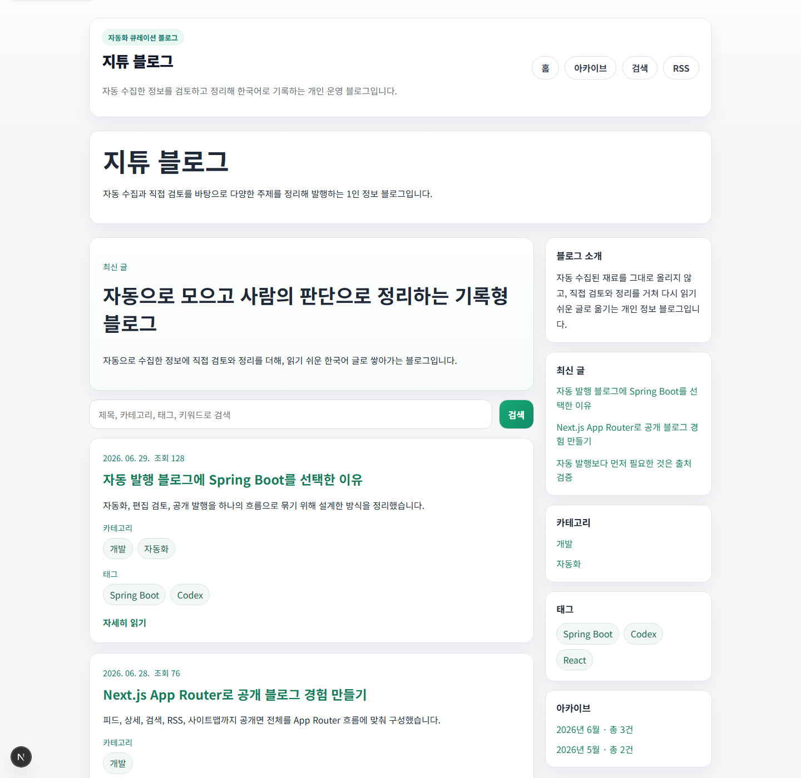
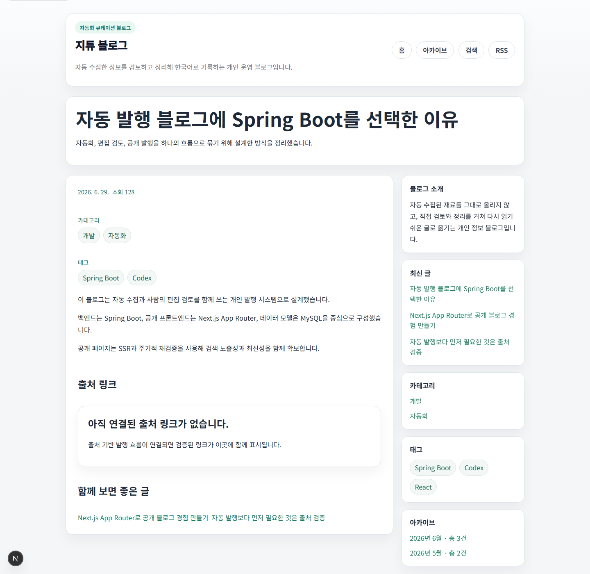
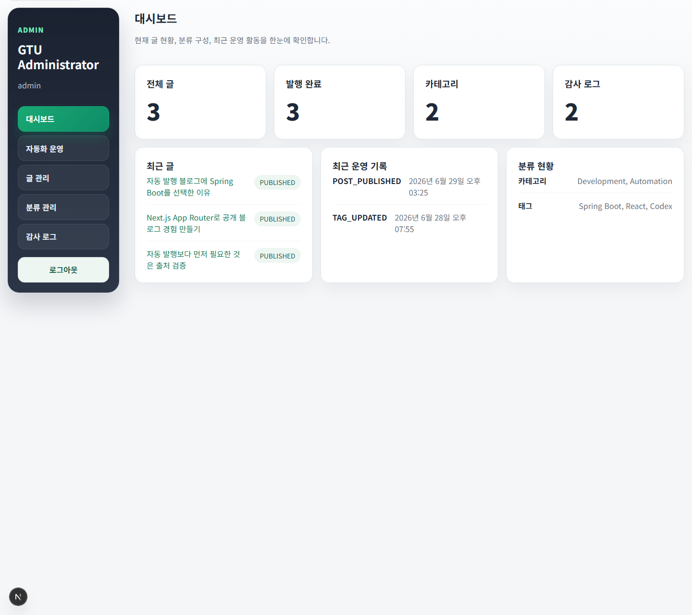
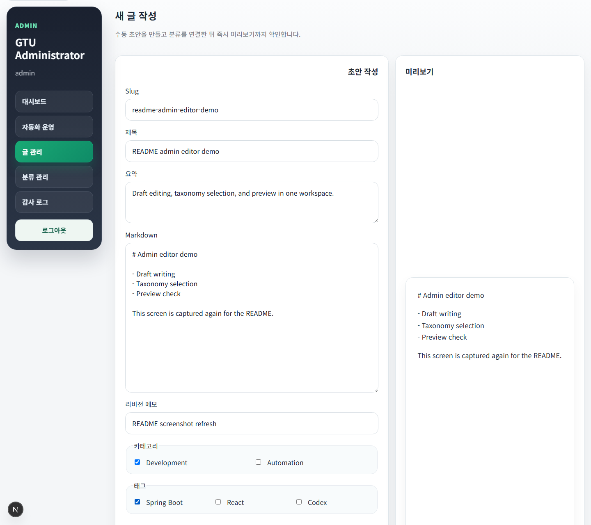
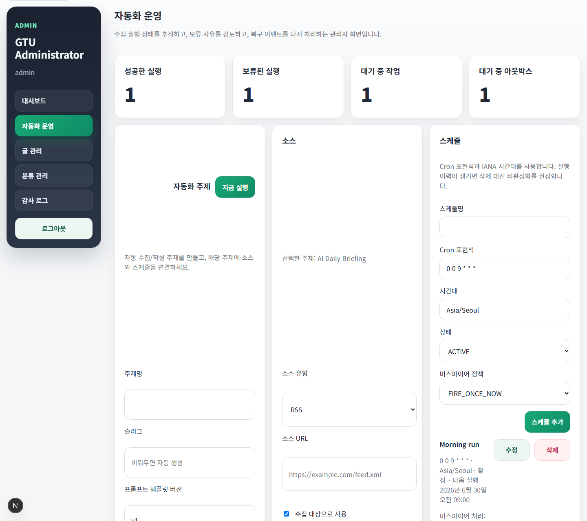
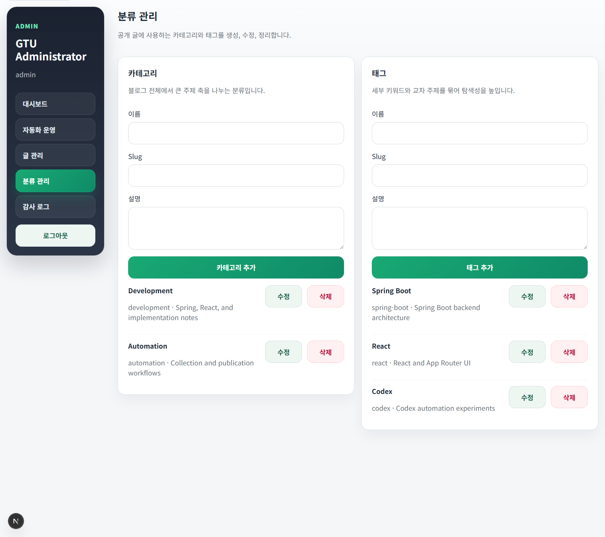

# GTU Blog

GTU Blog는 자동 정보 수집, 자동 초안 생성, 관리자 검수/수정, 공개 블로그 발행을 하나의 흐름으로 묶은 개인 운영형 자동화 블로그 프로젝트입니다.

Spring Boot 백엔드, Next.js 프론트엔드, MySQL, generation-worker를 기반으로, “내가 나를 위해 쓰는 자동화 블로그”를 실사용 가능한 수준으로 운영하는 것을 목표로 합니다.

## 한눈에 보기

- 공개 블로그와 관리자 운영 화면을 하나의 저장소에서 함께 관리
- 자동화 주제, 수집 소스, 스케줄, 실행 이력, 복구 아웃박스까지 운영 관점으로 통합 설계
- 관리자가 초안 작성/수정/발행을 직접 할 수 있고, 자동화 실행 결과도 수동 검수 가능
- Spring Boot가 인증, 권한, 발행, 감사, 자동화 상태의 최종 권한을 보유
- generation-worker는 비신뢰 경계로 분리되어 직접 발행이나 DB 접근 권한이 없음

## 이 프로젝트가 해결하는 문제

일반적인 블로그 README는 “글을 쓴다” 수준에서 끝나지만, GTU Blog는 아래 흐름 전체를 다룹니다.

1. 관심 주제와 소스를 등록한다.
2. 자동화 스케줄 또는 수동 실행으로 수집을 시작한다.
3. 생성 결과가 초안/보류/실패/성공 상태로 기록된다.
4. 관리자가 초안을 수정하거나 보류 사유를 검토한다.
5. 승인된 글만 공개 블로그에 반영된다.
6. 감사 로그, 실행 이력, 아웃박스 상태로 운영 추적이 가능하다.

즉, 단순 CMS가 아니라 “정보 수집 + 생성 + 검수 + 발행 + 운영 추적”까지 이어지는 자동화 블로그 운영 도구에 가깝습니다.

## 대상 사용자

- 1차 사용자: 프로젝트 소유자 본인
- 용도:
  - 내가 지속적으로 모아봐야 하는 정보를 자동으로 수집
  - 초안 생성 후 빠르게 검수/수정
  - 공개 블로그 형태로 축적

## 핵심 기능

### 공개 블로그

- 최신 글 목록
- 글 상세 페이지
- 카테고리/태그별 글 목록
- 검색 페이지
- 아카이브 페이지
- RSS, sitemap, robots.txt
- SSR 기반 메타데이터와 검색엔진 친화 HTML 제공

### 관리자 기능

- 관리자 로그인
- 글 작성, 수정, 발행, 보관, 삭제, 복원
- 리비전 이력 조회와 복원
- 카테고리/태그 관리
- 감사 로그 조회

### 자동화 운영 기능

- 자동화 주제 관리
- 수집 소스 관리
- 자동화 스케줄 관리
- 수동 실행
- 실행 이력 및 실행 상세 조회
- 보류 실행 재시도
- 실행 중 자동화 취소
- 보류 초안 수동 발행
- 운영 진단 정보와 발행 복구 아웃박스 상태 확인

## 기능 소개 화면

### 1. 공개 블로그 메인

최신 글 목록, 소개 카피, 검색/분류/탐색 동선을 한 화면에 배치한 공개 메인입니다.



### 2. 공개 글 상세

발행된 글의 본문, 메타 정보, 관련 글, 분류 정보를 확인할 수 있는 상세 화면입니다.



### 3. 관리자 대시보드

전체 글 수, 발행 현황, 분류 수, 최근 운영 기록을 요약해서 보여주는 관리자 첫 화면입니다.



### 4. 관리자 글 편집기

초안 작성, 분류 선택, 마크다운 입력, 미리보기를 한 번에 처리할 수 있는 편집 화면입니다.



### 5. 자동화 운영 센터

자동화 주제, 수집 소스, 스케줄, 실행 이력, 진단 정보, 복구 아웃박스를 통합 관리하는 화면입니다.



### 6. 분류 관리 화면

카테고리와 태그를 각각 생성, 수정, 삭제할 수 있는 운영 화면입니다.



## 시스템 구성

### 런타임 구성 요소

- `frontend/`
  - Next.js App Router 기반 공개 블로그 + 관리자 UI
- `backend/`
  - Spring Boot 기반 인증, 권한, 글, 자동화, 감사, 발행 API
- `generation-worker/`
  - 자동화 실행을 claim/submit 계약으로 처리하는 분리 워커
- `contracts/`
  - API 및 자동화 계약 정의
- `e2e/`
  - Playwright 종단간 테스트
- `ops/`
  - Prometheus / Grafana 로컬 운영 관측 설정

### 발행/운영 흐름

```text
관리자/스케줄
   ↓
Spring Boot 자동화 실행 생성
   ↓
generation-worker 작업 claim
   ↓
수집/초안 생성/정책 검사 결과 제출
   ↓
Spring Boot가 최종 상태 확정
   ├─ 성공 → 공개 글 반영 + 후속 이벤트 기록
   ├─ 보류 → 관리자 검토 대기
   └─ 실패 → 실행 이력 및 사유 기록
```

## 기술 스택

### Backend

- Java 25
- Spring Boot 4.1
- Spring MVC
- Spring Data JPA
- Spring Security
- OAuth2 Resource Server / JWT
- Quartz Scheduler
- Flyway
- Micrometer / Prometheus
- jsoup
- Rome
- Resilience4j

### Frontend

- Next.js 16 App Router
- React 19
- TypeScript

### Database

- MySQL 8.4

### Generation Worker

- Node.js
- TypeScript
- Provider-neutral job contract
- `@openai/codex-sdk` 연동은 조건부 운영 경로로 설계

### Test / QA

- JUnit 5
- Testcontainers
- WireMock
- Vitest
- Playwright

## 저장소 구조

```text
backend/             Spring Boot 백엔드
frontend/            Next.js 공개/관리자 UI
generation-worker/   생성 작업 워커
contracts/           API 및 자동화 계약
e2e/                 Playwright E2E
docs/                개발/보안/자동화/운영 문서
ops/                 로컬 운영용 관측 및 구성 파일
scripts/             품질 게이트 및 운영 보조 스크립트
```

## 빠른 시작

사전 준비사항:

- Java 25
- Node.js 24+
- pnpm 11+
- Docker Desktop 또는 Docker Engine

### 1. 의존성 설치

```powershell
pnpm install
```

### 2. 환경 변수 준비

`.env.example`을 복사해 로컬 실행용 `.env`를 만들고 placeholder 값을 교체합니다.

```powershell
Copy-Item .env.example .env
```

특히 아래 값은 반드시 로컬 값으로 교체해야 합니다.

- `MYSQL_PASSWORD`
- `MYSQL_ROOT_PASSWORD`
- `ADMIN_BOOTSTRAP_PASSWORD`
- `AUTOMATION_WORKER_SHARED_TOKEN`
- `AUTOMATION_REVALIDATION_SHARED_SECRET`
- `GRAFANA_ADMIN_PASSWORD`

### 3. MySQL 실행

```powershell
docker compose up -d mysql
docker compose ps
```

### 4. 백엔드 실행

```powershell
backend\gradlew.bat bootRun
```

### 5. 프론트 실행

```powershell
pnpm --dir frontend dev
```

### 6. 워커 실행 예시

단순 UI 검증만 할 때는 필수는 아니지만, 자동화 실행 흐름을 확인하려면 워커를 함께 실행합니다.

```powershell
pnpm --dir generation-worker build
pnpm --dir generation-worker start:once
```

### 7. 관측 스택 실행 예시

```powershell
docker compose up -d prometheus grafana
```

## 로컬 접속 정보

기본 로컬 설정 기준으로 아래 주소를 사용합니다.

| 대상 | 기본 주소 |
| --- | --- |
| 공개/관리자 프론트 | `http://127.0.0.1:3000` |
| 백엔드 API | `http://127.0.0.1:8080/api/v1` |
| Prometheus | `http://127.0.0.1:9090` |
| Grafana | `http://127.0.0.1:3001` |
| MySQL | `127.0.0.1:3306` |

## 로컬 관리자 로그인

개발 환경에서는 `.env`의 관리자 bootstrap 계정을 사용합니다.

- 기본 사용자명: `admin`
- 비밀번호: `.env`의 `ADMIN_BOOTSTRAP_PASSWORD`

프론트 개발용 mock/runtime 경로에서는 테스트 편의를 위해 `admin / admin-test-password` 조합이 사용되는 화면이 있을 수 있지만, 실제 로컬 확인 시에는 `.env` 기준 계정을 우선 사용하세요.

## 자주 쓰는 실행 시나리오

### 공개 블로그만 빠르게 보기

1. `docker compose up -d mysql`
2. `backend\gradlew.bat bootRun`
3. `pnpm --dir frontend dev`
4. 공개 홈과 관리자 로그인 확인

### 관리자 편집 기능 확인

1. 위 기본 실행 완료
2. `/admin/login` 접속
3. 새 글 작성 → 저장 → 상세 편집 → 발행 확인

### 자동화 운영 흐름 확인

1. 위 기본 실행 완료
2. `generation-worker` 빌드/실행
3. `/admin/automation`에서 주제/소스/스케줄 등록
4. 수동 실행 → 실행 이력/보류/복구 상태 확인

## 검증 명령

### 루트 품질 게이트

```powershell
pnpm quality
```

### 백엔드

```powershell
backend\gradlew.bat check
backend\gradlew.bat mysqlCompatibilityTest --tests "com.gtublog.automation.AutomationPipelineIntegrationTests"
```

### 프론트엔드

```powershell
pnpm --dir frontend lint
pnpm --dir frontend typecheck
pnpm --dir frontend test
pnpm --dir frontend build
pnpm exec playwright test
```

### 워커

```powershell
pnpm --dir generation-worker lint
pnpm --dir generation-worker typecheck
pnpm --dir generation-worker test
pnpm --dir generation-worker build
```

### 통합/운영 검증

```powershell
pnpm e2e:fullstack
pnpm drill:backup-restore
pnpm drill:restart-recovery
docker compose config
```

## 운영 및 보안 메모

- 브라우저와 백엔드는 production에서 same-origin 기준으로 동작하도록 설계됩니다.
- Spring Boot가 인증, 권한, 발행, 자동화 상태의 최종 권한을 가집니다.
- generation-worker는 비신뢰 경계이며 데이터베이스 직접 접근 권한이나 직접 발행 권한을 가지지 않습니다.
- 자동 발행은 출처 접근 가능, 독립 출처 보강, 중복 검사를 모두 통과해야 합니다.
- 보류 실행은 기록으로 남고 관리자 후속 조치가 가능해야 합니다.
- access token은 브라우저 메모리에만 존재해야 하며, refresh는 `HttpOnly` 쿠키 경로로 처리됩니다.
- 운영 시크릿과 키는 저장소가 아닌 외부 비밀 관리 경로로 주입해야 합니다.

## 문서 바로가기

- [AGENTS.md](./AGENTS.md)
- [DESIGN.md](./DESIGN.md)
- [docs/development.md](./docs/development.md)
- [docs/security.md](./docs/security.md)
- [docs/automation.md](./docs/automation.md)
- [docs/runbook.md](./docs/runbook.md)
- [docs/deployment.md](./docs/deployment.md)
- [docs/omx-validation-loop.md](./docs/omx-validation-loop.md)

## 현재 상태 요약

- 공개 블로그 기본 기능 구현 완료
- 관리자 글/분류/감사 기능 구현 완료
- 자동화 주제/소스/스케줄 관리 구현 완료
- 보류 실행 재시도/취소/수동 발행 구현 완료
- 관리자 UI 한국어화 및 운영 UX 개선 반영 완료
- 로컬 백엔드/프론트/Playwright/MySQL 기반 검증 루프 정리 완료

## 알려진 범위와 비목표

현재 README 기준 범위 밖인 항목:

- 다중 작성자
- 공개 회원가입/댓글/좋아요
- 뉴스레터/푸시
- 수익화 기능
- 클라우드 벤더별 배포 모듈

## 다음 우선순위

- 실배포 리허설 및 운영 검증 스토리 정의
- 배포 환경 기준 smoke test / 복구 테스트 강화
- 자동화 품질 고도화와 운영 모니터링 보강
